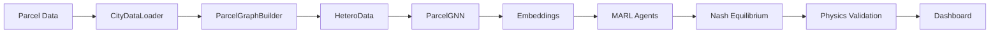

# PIMALUOS

**Physics Informed Multi-Agent Land Use Optimization Software**

PIMALUOS is a comprehensive framework for urban land-use planning that combines:

- **Graph Neural Networks (GNN)** for spatial representation learning
- **Multi-Agent Reinforcement Learning (MARL)** for stakeholder negotiation
- **Physics-based simulation** for traffic, hydrology, and solar analysis
- **LLM-RAG** for automated zoning constraint extraction

## ✨ Features

- 🗺️ **Multi-city support** - Manhattan, Chicago, LA, Boston (extensible)
- 🧠 **Heterogeneous GNN** - 5 edge types for parcel relationships
- 🤝 **5 stakeholder agents** - Residents, developers, planners, environmentalists, equity advocates
- ⚡ **Real-time physics** - Traffic flow, stormwater runoff, shadow analysis
- 📊 **Interactive dashboard** - Next.js + deck.gl + CesiumJS
- 🔧 **Pip-installable** - Easy integration into existing workflows

## 🚀 Quick Start

```bash
# Install
pip install pimaluos

# Load and visualize Manhattan parcels
from pimaluos.core import get_data_loader, ParcelGraphBuilder
from pimaluos.models import ParcelGNN

# Load data
loader = get_data_loader("manhattan")
gdf, features = loader.load_and_compute_features()

# Build graph
builder = ParcelGraphBuilder(gdf, features)
graph = builder.build_hetero_data()

# Train GNN
model = ParcelGNN(input_dim=47, hidden_dim=128)
```

## 📚 Documentation

| Section | Description |
|---------|-------------|
| [Installation](getting-started/installation.md) | Setup instructions |
| [Quick Start](getting-started/quickstart.md) | 5-minute tutorial |
| [User Guide](guide/data-loading.md) | Detailed usage |
| [API Reference](api/core.md) | Full API documentation |
| [Examples](examples/manhattan.md) | Jupyter notebooks |

## 🏗️ Architecture



## 📖 Citing

```bibtex
@article{pimaluos2024,
  title={PIMALUOS: Physics Informed Multi-Agent Land Use Optimization},
  author={...},
  journal={Computers, Environment and Urban Systems},
  year={2024}
}
```

## 📄 License

MIT License - See [LICENSE](about/license.md)
